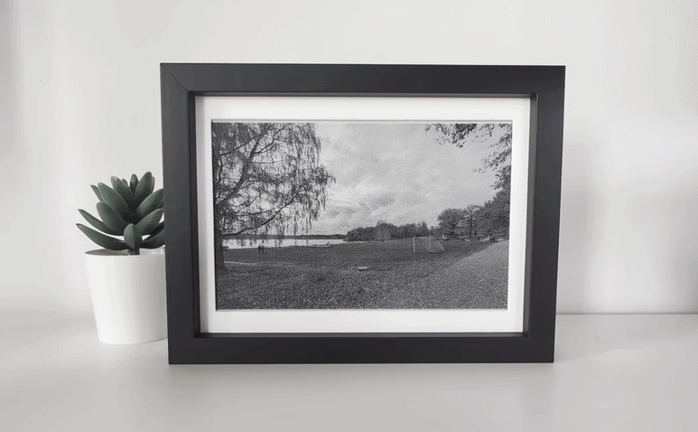

# Stillness firmware



**Stillness** is a battery-powered e-paper photo frame, surfacing memories from Google Photos albums using a custom server and this ESPHome firmware. Read more in the [blog post](https://oscarb.medium.com/2de0da83912b) or check out the [server](https://github.com/oscarb/stillness-server).

**Stillness firmware** is an ESPHome config for an e-paper photo display powered by an ESP32.  Combined with the *Stillness server* it can used as a battery-powered photo frame that downloads and displays images from albums in Google Photos.

## Features

- **Remote image download**: Fetches PNG images from a configurable server URL
- **Battery monitoring**: Tracks battery voltage and percentage with low-battery warnings
- **Deep sleep**: Ultra-low power consumption with configurable sleep duration (default 6 hours)
- **WiFi connectivity**: Connects to WiFi for image downloads and Home Assistant integration
- **Home Assistant API**: Full integration with Home Assistant for monitoring and control
- **Maintenance Mode**: Extended wake time on cold boot for flashing new firmware

## Hardware requirements

I used the [TRMNL 7.5" (OG) DIY Kit](https://www.seeedstudio.com/TRMNL-7-5-Inch-OG-DIY-Kit-p-6481.html) but other ESP32 and displays may work too. 

> **Note:** Fetching PNG images may require extra memory so consider a board with extra PSRAM.

## Software requirements

- [ESPHome](https://esphome.io/)
- Access to a web server hosting PNG images
- Home Assistant (optional, for API integration)

## Quick start

### 1. Clone or download the firmware

#### Option A: Remote package

```yaml
esphome:
  name: your_device_name
  # ... other config

packages:
  remote_package:
    url: https://github.com/oscarb/stillness-firmware
    ref: main
    files: [stillness.yaml]
```

#### Option B: Local copy

Download `stillness.yaml` to your ESPHome config directory.

### 2. Set up secrets

Create or update `secrets.yaml` file in your ESPHome config directory to include:

```yaml
stillness_server_url: "https://stillness-server:3000/image"
stillness_api_key: "your_home_assistant_api_key"
stillness_ota_password: "your_ota_password"
wifi_ssid: "your_wifi_ssid"
wifi_password: "your_wifi_password"
```

#### Notes

- `server_url`: URL to a PNG image that will be displayed on the e-paper
- `api_key`: Encryption key for Home Assistant API (generate a random string)
- `ota_password`: Password for over-the-air updates
- Adjust `battery_low_threshold` and `sleep_duration` in `stillness.yaml` if needed


### 3. Flash the device

1. Connect your Seeed Xiao ESP32 S3 to your computer
2. Depending on where you run ESPHome and if it can access the USB port:
    * If it can, compile and install the firmware directly
    * Otherwise, compile and download the firmware (modern), then use [ESPHome web](https://web.esphome.io/) to flash the firmware

### 4. Initial setup

Once the firmware is installed, every time the device is started (cold boot) it will show a maintenance icon.


On the first boot:

- The device enters maintenance mode for 60 seconds
- Connects to your WiFi network
- The display shows a maintenance icon
- After 60 seconds, it attempts to download and display the image
- Once image is downloaded and successfully displayed, it goes into deep sleep


## Configuration options

### Sleep duration

Default sleep duration is 6 hours. Change in substitutions:

```yaml
sleep_duration: "6h"  # Options: 1h, 2h, 6h, 12h, etc.
```

### Battery calibration

The battery level sensor uses a linear calibration curve. You may need to adjust the voltage-to-percentage mapping in `stillness.yaml`:

```yaml
filters:
  - calibrate_linear:
      - 4.15 -> 100.0  # Fully charged
      - 3.27 -> 0.0    # Fully discharged
```

